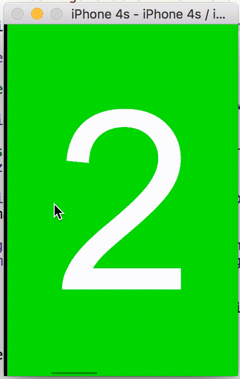
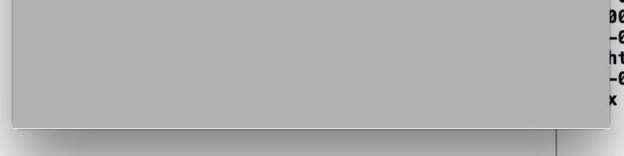

# NestedScrollingProblems
Test example for nested scrolling problems

## Problem description:

I have one iOS project for browsing images with nested `UIScrollViews` which is inspired by famous Apple's [PhotoScroller](https://developer.apple.com/library/content/samplecode/PhotoScroller/Introduction/Intro.html).
The problem is what sometimes scrolling just "stuck" when image is zoomed width- or height-wise. Here is an example of how it looks on `iPhone 4s` for image of size `935x1400` zoomed height-wise:

(I start dragging to left, but scroll view immediatly discard this action and image get "stuck")



## Workaround:

I found kind of workaround by adjusting content size of inner scroll view to nearest integer after zooming:


```obj-c
// Inside ImageScrollView.m

- (void)setZoomScale:(CGFloat)zoomScale
{
    [super setZoomScale:zoomScale];
    [self fixContentSizeForScrollingIfNecessary];
}

- (void)zoomToRect:(CGRect)rect animated:(BOOL)animated
{
    [super zoomToRect:rect animated:animated];
    [self fixContentSizeForScrollingIfNecessary];
}

- (void)fixContentSizeForScrollingIfNecessary
{
    if (SYSTEM_VERSION_LESS_THAN(@"10.2"))
    {
        CGSize content = self.contentSize;
        content.width = rint(content.width);
        content.height = rint(content.height);
        self.contentSize = content;
    }
}
```

But this fix not perfect - some images now are shown with one-pixel wide stripes on sides. For example, on `iPhone 6` for image of size `690x14300` it shows this at the bottom:



Also, oddly enough, I'm able to reproduce this problem on `iOS 7.0 - 10.1`, but everything works correctly on `iOS 10.2` and greater.

So, kind of good-old Apple's bug, hah? :grin:
